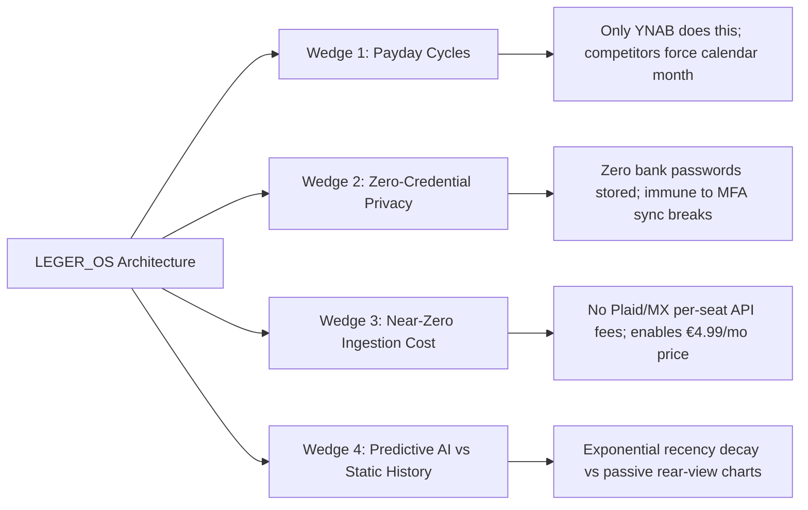

# Competitive Landscape & Strategic Market Positioning

> Strategic analysis of consumer Personal Finance Management (PFM) incumbents, data ingestion economics, pricing benchmarks, and LEGER_OS's core market wedges.

---

## 1. Executive Summary & Core Strategic Theses

LEGER_OS's architectural choices—**payday-cycle budgeting**, **predictive cash flow forecasting**, **zero-credential notification/PDF ingestion**, and **conversational AI synthesis**—create distinct structural advantages and define clear trade-offs:

### The Three Structural Wins & One Intentional Trade-off
1. **Payday-Cycle Budgeting (Strongest Wedge)**: Incumbents force rigid calendar-month budgeting. Biweekly, weekly, and irregular-income earners are unserved or forced into awkward workarounds. Only YNAB aligns with paydays, but charges $109/yr with a steep learning curve and no predictive forecasting.
2. **Zero-Credential Privacy & Reliability**: A documented demographic refuses to hand over bank credentials to aggregators. LEGER_OS provides the "missing middle": automated parsing without third-party credential exposure.
3. **Zero Marginal Aggregator Cost**: Every incumbent pays recurring per-connection fees to Plaid/MX/Finicity/Yodlee. LEGER_OS's client/server statement and notification parsing costs near-zero per seat, enabling sustainable €4.99/mo pricing.
4. **The Realistic Trade-off**: Notification reading and batch PDF parsing require deliberate interaction compared to background live feeds. The pitch must **never** be "more automatic," but rather: *"Connections that never silently break, zero credentials at risk, and true payday synchronization."*

---

## 2. Global & European Competitor Benchmarks

### Incumbent Pricing & Method Matrix

| App | Free Tier | Monthly | Annual | Budgeting Method | Target Region |
|---|---|---|---|---|---|
| **Copilot Money** | No (trial only) | $13.00 | $95.00 | Adaptive "smart budgets" + rollovers | US only |
| **Monarch Money** | No (trial only) | $14.99 | $99.99 (Plus $199.99) | Flexible/category (calendar month only) | US / Canada |
| **Rocket Money** | Yes (usable) | $7.00–$14.00 | $84.00–$168.00 | Category budgets (monthly) | US only |
| **YNAB** | No (34d trial) | $14.99 | $109.00 | Zero-based, paycheck-aligned | US / EU / Global |
| **Empower Dashboard** | Yes (free) | Free | Free | Net-worth / wealth tracking (weak budgeting) | US only |
| **PocketGuard** | Yes (limited) | $12.99 | $74.99 | "In My Pocket" safe-to-spend (monthly) | US / UK / CA |
| **Simplifi (Quicken)** | No | $6.99 (promo $3.99) | $47.88–$83.88 | Monthly spending plan (no biweekly) | US / Canada |
| **Wallet (BudgetBakers)** | Yes (basic) | ~€4.49 | ~€29.99 | Category / envelope (monthly) | EU / Global |
| **Spendee** | Yes (basic) | ~€5.50 | ~€35.99 | Shared wallets / monthly budgets | EU / Global |
| **Emma** | Yes (basic) | ~€4.99 | ~€41.99 | Open banking categorization | UK / Limited EU |
| **Finary** | Yes (lite) | n/a | €54.99–€149.99 | Net-worth & portfolio tracking | EU (FR/DE/PT) |
| **LEGER_OS** | **Yes (Core Free)** | **€4.99 / $4.99** | **~$50.00** | **Paycheck Cycle + Exponential Decay ($\lambda=0.12$)** | **Global / EU Focus** |

### Pricing Dynamics & The Post-Mint Backlash
* **Market Clearing Band**: Global paid PFMs clear at **$75–$110/year**.
* **EU Market Band**: European apps sit tightly at **€4.49–€5.50/month**. LEGER_OS at €4.99/mo (tax-inclusive) sits perfectly in the European sweet spot while severely undercutting US apps.
* **Pricing Fatigue**: The post-Mint market is plagued by price resentment (e.g. Monarch at $100/yr, Simplifi 50-70% renewal jumps, PocketGuard 214% price hike to $74.99). LEGER_OS provides predictable, transparent pricing without bait-and-switch annual renewals.

---

## 3. Feature Coverage Comparison

| Capability | Copilot | Monarch | Rocket Money | YNAB | Empower | Simplifi | LEGER_OS |
|---|---|---|---|---|---|---|---|
| **Paycheck-Cycle Align** | ❌ (Monthly) | ❌ (Monthly) | ⚠️ (Payday view only) | ✅ (Paycheck based) | ❌ (Monthly) | ❌ (Monthly) | ✅ **Native Cycle Engine** |
| **Net Worth Tracking** | ✅ | ✅ | ✅ (Paid) | ✅ (Reports) | ✅ | ✅ | ✅ **Live Multi-Asset Portfolio** |
| **Cash-Flow Forecast** | ❌ (Historical) | ⚠️ (Plus only, web) | ⚠️ (Basic safe spend) | ❌ ("No forecasting") | ❌ | ✅ (Projected flows) | ✅ **Daily Exponential Simulation** |
| **Conversational AI** | ⚠️ (Assistant) | ⚠️ (Basic AI) | ❌ | ❌ | ❌ | ⚠️ (AI search) | ✅ **Multi-Provider Neural Bridge** |
| **Subscription Radar** | ✅ | ✅ | ✅ | ⚠️ (Recurring only) | ⚠️ (Basic) | ✅ | ✅ **Price Hike & Cadence Radar** |
| **Zero-Credential Ingestion**| ❌ (Aggregator only)| ❌ (Aggregator only)| ❌ (Aggregator only)| ❌ (Aggregator only)| ❌ (Aggregator only)| ❌ (Aggregator only)| ✅ **Push & Statement Parser** |
| **EU / Portugal Support** | ❌ (US only) | ❌ (US/CA only) | ❌ (US only) | ✅ (Select banks) | ❌ (US only) | ❌ (US only) | ✅ **Global / Multi-Currency** |

---

## 4. Ingestion Economics & Sync Reliability Crisis

### The Hidden Aggregator Tax
All mainstream incumbents rely on aggregators (Plaid, MX, Finicity, Yodlee, Salt Edge). Aggregators charge recurring per-connected-account monthly fees or API usage tiers.
* This creates high linear variable operating costs per user.
* Forces incumbents to charge $95–$110+/year just to maintain gross margins.
* LEGER_OS bypasses aggregators entirely for its primary ingestion, maintaining near-zero marginal data cost.

### Sync Breakage Data
* Industry statistics demonstrate that screen-scraping aggregators fail in **~22% of sync attempts** compared to ~0.5% for native direct bank APIs.
* Top user complaints across Monarch, Copilot, and Simplifi are sync outages, re-authentication loops, and accounts lagging 4+ days behind.
* LEGER_OS eliminates 100% of aggregator breakages because ingestion runs on local device push notifications, clipboard parses, and raw PDF/extract statements.

---

## 5. European & Portugal Market Truths

### Debunking the "Unsupported Banks" Myth
* **The Reality in Portugal**: Major Portuguese financial institutions (*Millennium BCP, Caixa Geral de Depósitos, Novo Banco, Santander PT, ActivoBank, BPI, Revolut*) are already covered by European Open Banking aggregators (Nordigen/GoCardless, Tink, Yapily, TrueLayer, Plaid).
* **The Positioning Pivot**: Do **not** market LEGER_OS in Portugal as *"works with banks other apps can't reach"*. Instead, market it on:
  1. **Zero Credential Exposure**: Never give your bank credentials or open-banking consents to a third-party server.
  2. **True Payday Alignment**: Budgeting tuned for 14-month salaries, biweekly pay, and irregular bonuses.
  3. **Absence of US Incumbents**: US leaders (Copilot, Monarch, Rocket Money, Empower, Simplifi) do not operate in Portugal.
  4. **High-Precision AI & Math Engine**: Advanced recency-decay velocity and conversational synthesis absent in simplistic EU trackers (Wallet, Spendee, Finary).

---

## 6. Go-To-Market Wedges (Ranked Priority)

1. **Wedge #1 — Payday-Cycle & Irregular Income Earners**
   * *Target*: Biweekly, weekly, and freelance/contract workers tired of calendar-month resets.
   * *Positioning*: *"Budget by paycheck, not by calendar. YNAB's precision without the $109/yr fee or the steep learning curve."*
2. **Wedge #2 — Privacy-First & Credential-Averse Segment**
   * *Target*: Users who refuse Plaid/aggregator bank linking and are tired of tedious manual entry.
   * *Positioning*: *"Automated tracking without ever sharing a bank password."*
3. **Wedge #3 — European / International Power Users**
   * *Target*: European users looking for a modern, beautiful PFM that integrates net worth, subscriptions, and AI where US leaders refuse to ship.
   * *Positioning*: *"The sovereign personal finance mainframe built for global and European accounts."*

---

## 7. Cross-Reference Links

- 📐 **Projection Engine Standards**: [[00 - System & AI/Mathematical Projection Engine|Mathematical Projection Engine]]
- ⚡ **Growth & Retention Systems**: [[00 - System & AI/Growth Architecture & High-Retention Features|Growth Architecture & High-Retention Systems]]
- 💳 **Monetization & Pricing Standards**: [[01 - Directives (SOPs)/01.04 - System Monetization & Design Standards|System Monetization & Design Standards]]
- 📡 **Subscription & Cadence Detection**: [[01 - Directives (SOPs)/01.11 - Automated Cadence & Recurring Subscription Engine SOP|Recurring Subscription Engine]]
