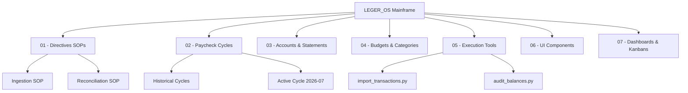

# LEGER_OS // Personal Finance Mainframe

Welcome to your **LEGER_OS** Obsidian Vault. This high-precision knowledge base connects your financial directives (SOPs), paycheck cycle projections, bank statement extractions, component architecture, and AI conversational overrides.

---

## ⚡ Mainframe Navigation Architecture



---

## 🚀 Quick Reference Links

- 📜 **Directives:** [[01 - Directives (SOPs)/01.01 - Statement Ingestion SOP|Statement Ingestion]] | [[01 - Directives (SOPs)/01.02 - Paycheck Cycle Reconciliation SOP|Cycle Reconciliation]]
- 📐 **Math Engine:** [[00 - System & AI/Mathematical Projection Engine|Recency Decay $\lambda = 0.12$ & Alpha Weighting]]
- 🤖 **AI Bridge:** [[00 - System & AI/Multi-Provider AI Bridge & Ingestion|Multi-Provider Bridge (Gemini 2.5 Pro, Groq, Ollama)]]
- 🎨 **UI Architecture:** [[06 - Architecture & UI Components/06.00 - Frontend Architecture Index|Frontend Component Reference]]
- 🛠️ **Python Tools:** [[05 - Execution Tools/05.00 - Layer 3 Scripts Overview|Python Execution Tools]]

---

## 📊 Dynamic Dataview Summary

```dataview
TABLE period AS "Period Label", income_deloitte AS "Income (€)", total_expenses AS "Expenses (€)", net_cashflow AS "Net (€)", status AS "Status"
FROM "02 - Paycheck Cycles"
WHERE cycle_id != null
SORT cycle_id DESC
```
