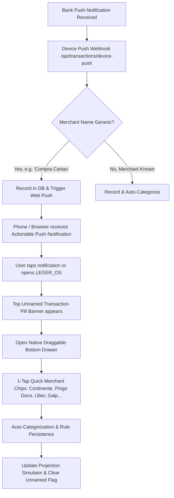

# 01.13 - PWA Web Push & Instant Merchant Resolver SOP

## Purpose & Scope
This Standard Operating Procedure establishes the architecture, service worker mechanics, and in-app resolver flow for **Actionable Web Push Notifications** and **1-Tap Unnamed Transaction Resolution** when bank push notifications lack merchant names (e.g. Santander generic card debits).

---

## 1. Problem Statement
European and global banking apps (e.g. Santander, Caixa Geral, MB WAY) frequently omit the store/merchant name from real-time OS push notifications for privacy, outputting only:
> *"Compra com cartão: -14.50 EUR na conta *1234"*

---

## 2. End-to-End Resolution Pipeline

---

## 3. Technical Specifications

1. **PWA Manifest (`public/manifest.json`):**
   - Dark theme `#09090b`, standalone display, orientation `portrait-primary`.
   - High-resolution SVG/PNG icons (`public/icon-512.svg`).

2. **Service Worker (`public/sw.js`):**
   - Handles `push` event: displays actionable notification with `renotify: true` and deep-link payload `/?resolveTxId=${txId}`.
   - Handles `notificationclick` event: focuses existing window or opens new window at resolver target.

3. **Backend Push Pipeline (`src/lib/web-push.ts`):**
   - Uses VAPID Web Push protocol to deliver background push alerts.
   - Stores subscriptions in `push_subscriptions` table with fallback in `profiles.push_subscriptions` JSONB.
   - Auto-cleans expired endpoints (`410 Gone / 404`).

4. **In-App Quick Name Resolver (`src/components/UnnamedTransactionResolver.tsx`):**
   - Top banner pill when unnamed transactions exist.
   - Draggable bottom drawer matching Rule 14 standard.
   - Dynamic extraction of user's top 8 most frequent merchants for 1-tap resolution.
   - Auto-rule creation checkbox (`Always categorize future transactions from this store`).
